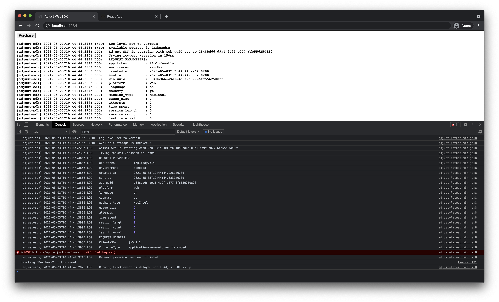
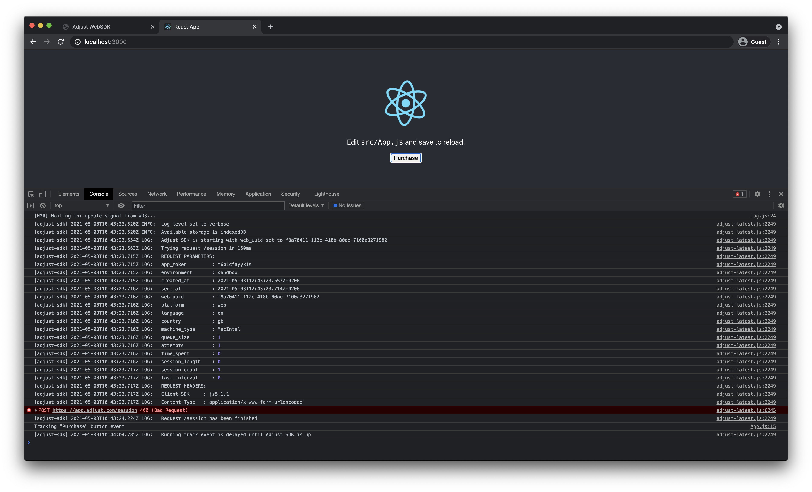

# adjust-issue

I setup this repo to share with you 2 examples of how the Adjust WebSDK integration is not working for us. This is not our actual setup but it demonstrate that the setup is not working for us in any way. We have a Vue integration but I'm sure I'm initializing the SDK in the right way, according to your README recommendation.

Feel free to run the projects by just running in the folders `yarn install` and `yarn start` (NodeJS setup required).

In both example cases, i'm seeing a `400` http error from a SDK call to `POST https://app.adjust.com/session`, reason why i think (just guessing) the SDK is not fully up when I want to track an event with `Adjust.trackEvent`.

**Questions are:**

- Why we have this error?
- Is this error the reason we can't track events with the SDK?
- Am I missing something?

### HTML example integration

In the `adjust-poc-web` folder there is an example using your demo app -> [https://github.com/adjust/web_sdk/blob/master/src/demo.html](https://github.com/adjust/web_sdk/blob/master/src/demo.html)

### ReactJS example integration

In the `adjust-poc-react` folder, there is an example with a newly created react app using [create-react-app](https://create-react-app.dev/)

